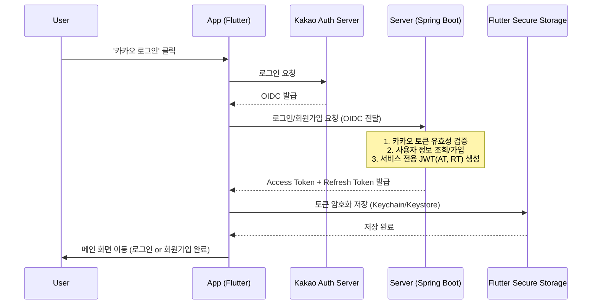
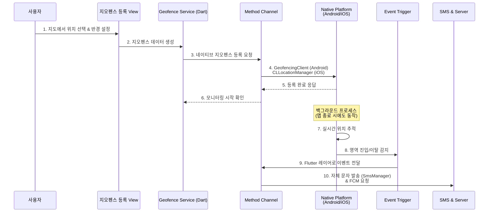
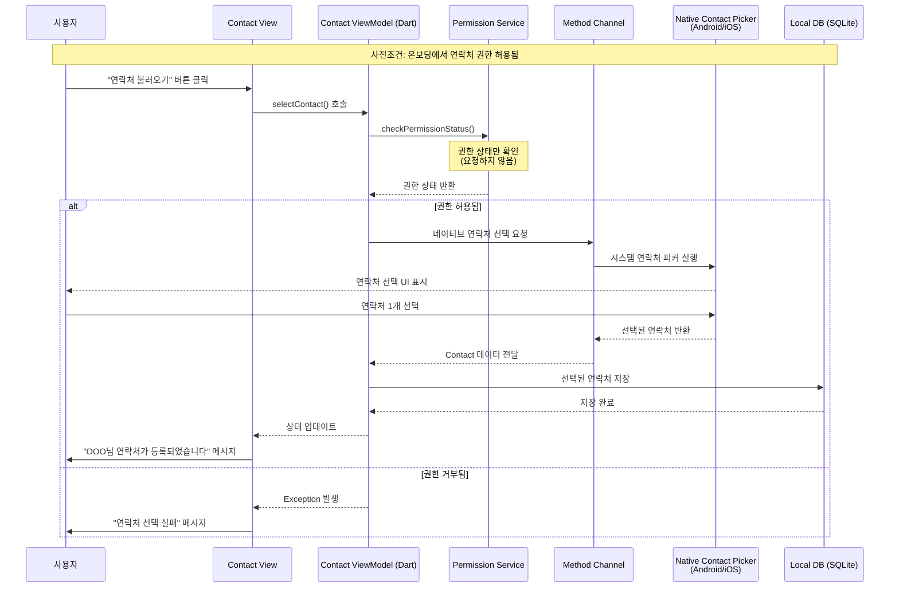
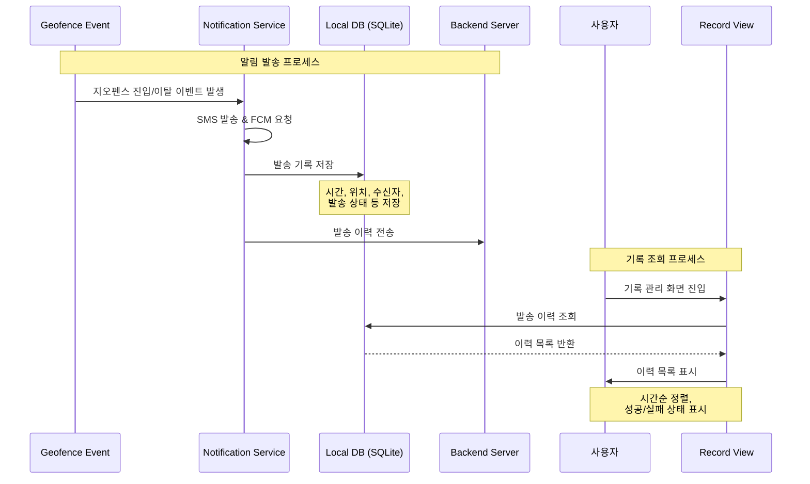

# ImHere
<p align="center">
  
</p>

# 0. 프로젝트 개요
- 해당 프로젝트는 "버스 터미널 도착 30분 전에 연락해" 라는 부모님의 말에서 시작되었습니다.
    - 서울 -> 거제로 이동하는 버스에서 항상 잠을 잤는데, 도착 30분전에 연락을 위해 일어나는 것이 사실상 불가능하였고, 이를 해결하기 위해 위치 기반으로 문자를 보내면 되겠다는 생각을 하였습니다.

### 주요 화면

##### 명시적 권한 요청 화면

<table align="center">
  <tr>
    <td align="center"></td>
    <td align="center"></td>
    <td align="center"></td>
    <td align="center"></td>
    <td align="center"></td>
  </tr>
</table>

##### 서비스 화면

<table align="center">
  <tr>
    <td align="center"></td>
    <td align="center"></td>
    <td align="center"></td>
    <td align="center"></td>
    <td align="center"></td>
  </tr>
</table>

### 주요 특징

- **명시적 권한 안내**: Google 정책에 맞게 명시적 권한 요청 화면
- **카카오 소셜 로그인**: 간편한 인증을 위한 카카오 OAuth2 로그인 지원
- **지오펜스 관리**: 특정 위치와 반경을 설정하여 지오펜스 영역을 등록하고 관리
- **위치 기반 알림**: 지오펜스 진입/이탈 시 자동 알림 발송
- **연락처 연동**: 기기 연락처와 연동하여 알림 수신자 관리
- **기록 관리**: 지오펜스 알림 발송 이력 조회

---

## *1. Skills*
-  

### Libraries
- **State Management**
    - `flutter_riverpod`: 전역 상태 관리, 비동기 로직 처리 및 의존성 주입을 안전하게 구현

- **Architecture & DI**
    - `go_router`: 딥링크 지원 및 직관적인 페이지 이동을 위한 선언형 라우팅 시스템
    - `get_it`, `injectable`: 의존성 주입(DI) 코드 자동 생성 및 서비스 로케이터 패턴 적용

- **Network & Data**
    - `dio`: Interceptor, Timeout 등 강력한 기능을 제공하는 HTTP 클라이언트
    - `json_annotation`: JSON 직렬화/역직렬화(Serialization) 보일러플레이트 코드 자동화

- **Local Storage & Security**
    - `sqflite`: 로컬 데이터 영속성을 위한 내장형 관계형 데이터베이스(SQLite)
    - `flutter_secure_storage`: Access Token 등 민감한 정보를 Keystore/Keychain에 안전하게 저장
    - `flutter_dotenv`: API Key 등 민감한 환경 설정을 코드와 분리하여 보안 강화

- **Map & Location**
    - `flutter_naver_map`: 국내 환경에 최적화된 네이버 지도 SDK 연동 및 오버레이 구현
    - `geolocator`: 디바이스의 실시간 GPS 좌표 수집 및 위치 권한 상태 확인

- **Firebase & Notification**
    - `firebase_core`, `firebase_messaging`: Firebase 프로젝트 초기화 및 FCM 푸시 알림 수신
    - `flutter_local_notifications`: 포그라운드 알림 노출 및 로컬 알림 스케줄링 관리
    - `firebase_crashlytics`: 앱 비정상 종료(Crash) 로그 수집 및 안정성 모니터링
    - `firebase_analytics`: 사용자 행동 패턴 및 이벤트 데이터 분석

- **UI & Utils**
    - `flutter_screenutil`: 다양한 디바이스 화면 크기에 대응하는 반응형 레이아웃 구성
    - `kakao_flutter_sdk`: 카카오 로그인 인증 및 공유하기 기능 연동
    - `permission_handler`: 런타임 접근 권한 요청 프로세스 및 거부 상태 핸들링
    - `package_info_plus`: 앱의 버전 정보 및 빌드 번호 등 메타데이터 조회

- **Platform Integration**
    - **Method Channel**: Flutter와 네이티브 플랫폼(Android/iOS) 간 양방향 통신을 위한 플랫폼 채널 활용
        - 지오펜스 백그라운드 모니터링: Android `GeofencingClient`, iOS `CLLocationManager` 네이티브 API 직접 제어
        - SMS 발송: Android `SmsManager`를 통한 직접 문자 발송 기능 구현
        - 백그라운드 위치 추적 및 이벤트 트리거 처리

---

## 2. 주요 기능

#### 회원가입/로그인
- 카카오 SDK를 이용한 소셜 로그인
- 서버와의 연동을 통한 JWT 토큰 관리
- 보안 저장소를 통한 토큰 안전 보관 및 자동 갱신


#### 지오펜스 관리
- **지오펜스 목록**: 등록된 감시 영역 조회
- **지오펜스 등록**: 네이버 지도를 통한 직관적인 위치 선택 및 반경 설정
- **백그라운드 감지**: 앱이 꺼져있거나 백그라운드 상태에서도 진입/이탈 감지
- **네이티브 통합**: Method Channel을 통한 Android/iOS 네이티브 위치 서비스 활용



#### 연락처 관리
- 온보딩에서 연락처 권한 사전 획득
- 기기 연락처에서 알림 수신자 개별 선택
- 선택된 연락처만 로컬 DB에 저장 및 관리


#### 기록 관리
- 지오펜스 알림 발송 이력(시간, 위치, 수신자) 자동 저장 및 조회
- 실패 내역 확인


---

## 3. 프로젝트 구조

### 아키텍처 개요

본 프로젝트는 **MVVM (Model-View-ViewModel)** 패턴을 채택하였으며, 각 기능별로 모듈화 하였습니다.

#### 핵심 설계 원칙
- `Riverpod`으로 의존성 주입을 하지 않고, `GetIt` + `Injectable` 를 사용하고 있습니다.
- `Riverpod` 이 의존성 주입 및 상태 관리를 하면 이해가 어려워 해당 방식을 채택하였습니다.

```
lib
├── auth
│   ├── service
│   │   ├── auth_service.dart
│   │   ├── auth_service_interface.dart
│   │   ├── auth_state_provider.dart
│   │   ├── auth_state_provider.g.dart
│   │   ├── dto
│   │   │   ├── login_request_dto.dart
│   │   │   └── login_request_dto.g.dart
│   │   └── token_storage_service.dart
│   ├── view
│   │   ├── auth_view.dart
│   │   └── component
│   │       ├── login_button.dart
│   │       ├── login_button_info.dart
│   │       └── right_content_widget.dart
│   └── view_model
│       ├── auth_view_model.dart
│       └── auth_view_model_interface.dart
├── common
│   ├── database
│   │   ├── local_database_exception.dart
│   │   ├── local_database_properties.dart
│   │   └── local_database_service.dart
│   ├── result
│   │   ├── error_analyst.dart
│   │   ├── error_message.dart
│   │   └── result.dart
│   ├── router
│   │   ├── custom_page_transition
│   │   │   ├── buttom_up_transition.dart
│   │   │   ├── fade_transition.dart
│   │   │   └── simple_transition.dart
│   │   ├── router_provider.dart
│   │   ├── router_provider.g.dart
│   │   ├── routers.dart
│   │   └── routing_logic.dart
│   ├── theme
│   │   └── im_here_theme_data_light.dart
│   ├── util
│   │   ├── date_time_formatter.dart
│   │   └── phone_number_formatter.dart
│   └── view_component
│       ├── default_view.dart
│       └── widgets
│           ├── black_button.dart
│           ├── page_title.dart
│           ├── primary_button.dart
│           ├── section_title.dart
│           ├── select_button.dart
│           └── text_input_field.dart
├── contact
│   ├── repository
│   │   ├── contact_entity.dart
│   │   ├── contact_local_repository.dart
│   │   └── contact_repository.dart
│   ├── view
│   │   ├── component
│   │   │   └── contact_tile.dart
│   │   └── contact_view.dart
│   └── view_model
│       ├── contact.dart
│       ├── contact.g.dart
│       ├── contact_adapter.dart
│       ├── contact_view_model.dart
│       ├── contact_view_model.g.dart
│       ├── contact_view_model_interface.dart
│       └── contact_view_model_provider.dart
├── core
│   └── di
│       ├── di_setup.config.dart
│       ├── di_setup.dart
│       ├── dio
│       │   └── dio_module.dart
│       ├── local_database_module.dart
│       ├── permission_service_module.dart
│       └── secure_storage_module.dart
├── fcm
│   ├── fcm_message_handler.dart
│   ├── repository
│   │   ├── dto
│   │   │   ├── fcm_token.dart
│   │   │   └── fcm_token.g.dart
│   │   └── fcm_token_repository.dart
│   └── service
│       ├── fcm_token_service.dart
│       └── fcm_token_storage_service.dart
├── firebase_init_helper.dart
├── geofence
│   ├── repository
│   │   ├── geofence_entity.dart
│   │   ├── geofence_local_repository.dart
│   │   └── geofence_repository.dart
│   ├── service
│   │   ├── geofence_monitoring_service.dart
│   │   ├── geofence_monitoring_service.g.dart
│   │   └── sms_service.dart
│   ├── view
│   │   ├── geofence_enroll_view.dart
│   │   ├── geofence_view.dart
│   │   └── widget
│   │       ├── geofence_tile.dart
│   │       ├── map_select_view.dart
│   │       ├── recipient_select_view.dart
│   │       └── recipient_tile.dart
│   └── view_model
│       ├── geofence_enroll_view_model.dart
│       ├── geofence_enroll_view_model.g.dart
│       ├── geofence_list_view_model.dart
│       ├── geofence_list_view_model.g.dart
│       ├── geofence_view_model.dart
│       ├── geofence_view_model.g.dart
│       ├── geofence_view_model_interface.dart
│       ├── geofence_view_model_provider.dart
│       ├── recipient_select_view_model.dart
│       └── recipient_select_view_model.g.dart
├── main.dart
├── record
│   ├── repository
│   │   ├── geofence_record_entity.dart
│   │   ├── geofence_record_local_repository.dart
│   │   └── geofence_record_repository.dart
│   ├── view
│   │   ├── component
│   │   │   ├── device_tile.dart
│   │   │   ├── record_tile.dart
│   │   │   └── target_tile.dart
│   │   └── record_view.dart
│   └── view_model
│       ├── geofence_record_view_model.dart
│       └── geofence_record_view_model.g.dart
├── setting
│   ├── const
│   │   └── policy_data.dart
│   ├── view
│   │   ├── privacy_view.dart
│   │   ├── setting_components.dart
│   │   └── setting_view.dart
│   └── view_model
│       ├── setting_view_model.dart
│       ├── setting_view_model.g.dart
│       └── setting_view_model_state.dart
└── user_permission
    ├── model
    │   ├── items
    │   │   ├── contact_permission_item.dart
    │   │   ├── fcm_permision_item.dart
    │   │   ├── location_permission_item.dart
    │   │   └── sms_permission_item.dart
    │   ├── permission_item.dart
    │   └── permission_state.dart
    ├── service
    │   ├── concrete
    │   │   ├── contact_permission_service.dart
    │   │   ├── fcm_alert_permission_service.dart
    │   │   ├── locate_permission_service.dart
    │   │   └── sms_permission_service.dart
    │   ├── permission_service_interface.dart
    │   └── status_to_permission_state_converter.dart
    ├── view
    │   ├── user_permission_view.dart
    │   └── widgets
    │       ├── finish_page.dart
    │       ├── intro_page.dart
    │       └── permission_page.dart
    └── view_model
        ├── permissions.dart
        ├── user_permission_view_model.dart
        └── user_permission_view_model.g.dart
```

### 주요 모듈 설명

#### 1. Auth (인증 모듈)
- **역할**: 카카오 OAuth2 기반 소셜 로그인 및 JWT 토큰 관리
- **주요 컴포넌트**:
  - `AuthService`: 카카오 SDK 연동 및 서버 인증 처리
  - `TokenStorageService`: 토큰의 안전한 저장 및 조회 (`flutter_secure_storage` 활용)
  - `AuthViewModel`: 로그인 상태 관리 및 토큰 자동 갱신 로직

#### 2. Geofence (지오펜스 모듈)
- **역할**: 위치 기반 영역 설정 및 진입/이탈 감지
- **주요 컴포넌트**:
  - `GeofenceMonitoringService`: Method Channel을 통한 네이티브 지오펜스 API 제어
  - `SmsService`: 지오펜스 이벤트 발생 시 SMS 발송
  - `GeofenceEnrollView`: 네이버 지도 기반 위치 선택 UI
  - `GeofenceLocalRepository`: SQLite를 통한 지오펜스 데이터 영속화

#### 3. User Permission (권한 관리 모듈)
- **역할**: Google Play Prominent Disclosure 정책 준수 권한 온보딩
- **주요 컴포넌트**:
  - `PermissionServiceInterface`: 권한별 서비스 추상화 인터페이스
  - `UserPermissionView`: PageView 기반 순차적 권한 요청 UI
  - **지원 권한**: 위치(Location), 연락처(Contact), SMS, FCM 알림

#### 4. Common (공통 모듈)
- **Router**: `GoRouter` 기반 선언형 라우팅
  - ShellRoute를 통한 하단 네비게이션 바 공통 레이아웃
  - 커스텀 페이지 전환 애니메이션 (Fade, Bottom-up)
- **Result**: 함수형 에러 핸들링 패턴
  - `Success<T>` / `Failure<T>` sealed class
  - 일관된 에러 처리 및 사용자 피드백
- **Database**: SQLite 초기화 및 마이그레이션 관리

### 권한 관리 및 온보딩

본 앱은 Google Play Prominent Disclosure 정책을 준수하여 투명한 권한 요청 프로세스를 제공합니다.

#### 온보딩 플로우

1. **IntroPage**: 앱의 핵심 기능 소개 및 권한 필요성 설명
2. **PermissionPage**: 각 권한에 대한 상세 설명 및 개별 요청
   - 알림 권한 (FCM)
   - 연락처 권한
   - SMS 권한
   - 위치 권한 (Background 포함)
3. **FinishPage**: 온보딩 완료 및 메인 화면 진입

#### 권한 투명성

각 권한 요청 시 다음 정보를 명시적으로 제공합니다:
- **사용 목적**: 해당 권한이 왜 필요한지 설명
- **수집 데이터**: 어떤 데이터에 접근하는지 명시  
- **필수 여부**: 필수/선택 권한 구분


---

## 4. 라우팅 구조

본 프로젝트는 `go_router` 패키지를 사용하여 선언형 라우팅을 구현합니다.

### 라우트 구조

```
/user-permission    # 온보딩 권한 요청 화면 (최초 진입)
/auth               # 카카오 로그인 화면
/geofence           # 메인 화면 (지오펜스 목록)
  ├── /enroll       # 지오펜스 등록 화면
/contact            # 연락처 관리 화면
/record             # 알림 발송 기록 화면
/setting            # 설정 화면
```

### 스마트 라우팅 로직

`routing_logic.dart`에서 앱 초기 진입 시 사용자 상태에 따라 자동으로 적절한 화면으로 리다이렉트합니다:

```mermaid
flowchart TD
    A[앱 시작] --> B{권한 모두 허용?}
    B -->|아니오| C[/user-permission]
    B -->|예| D{로그인 완료?}
    D -->|아니오| E[/auth]
    D -->|예| F[/geofence]
```

---

## 5. 에러 핸들링

### Result 패턴

본 프로젝트는 `Result<T>` sealed class를 사용하여 함수형 에러 핸들링을 구현합니다.

```dart
sealed class Result<T> {
  R when<R>({
    required R Function(T data) success,
    required R Function(String message) failure,
  });
}

class Success<T> extends Result<T> { ... }
class Failure<T> extends Result<T> { ... }
```

#### 사용 예시

```dart
final result = await repository.save(data);

result.handle(
  context: context,
  onSuccess: (data) {
    // 성공 시 로직
  },
  showSnackBar: true, // 실패 시 자동으로 SnackBar 표시
);
```

### 에러 로깅

- `ErrorAnalyst.log()`: 에러 및 스택 트레이스 로깅
- Firebase Crashlytics 연동을 통한 프로덕션 환경 에러 추적

---

## 6. 설치 및 실행 가이드

### 필수 요구사항

- **Flutter SDK**: 3.x 이상
- **Dart SDK**: 3.x 이상
- **Android Studio** 또는 **Xcode** (iOS 빌드 시)

### 환경 변수 설정

프로젝트 루트의 `assets` 폴더 내에 `iam_here_flutter_secret.env` 파일 생성:

```env
# 카카오 SDK 설정
KAKAO_NATIVE_APP_KEY=your_kakao_native_app_key

# 네이버 지도 설정
NAVER_MAP_CLIENT_ID=your_naver_map_client_id

# 백엔드 API URL
API_BASE_URL=http://your-api-server-url
```

### 실행 방법

1. **의존성 설치**
```bash
flutter pub get
```

2. **코드 생성** (Freezed, Injectable, JsonSerializable 등)
```bash
dart run build_runner build --delete-conflicting-outputs
```

3. **앱 실행**
```bash
# Android
flutter run

# iOS (macOS only)
flutter run -d ios
```

---

## 7. 주요 기능 상세

### 설정 화면

- **권한 상태 확인**: 현재 등록된 권한들의 허용/거부 상태 조회
- **개인정보 보호 정책**: 앱 내 정책 문서 뷰어
- **버전 정보**: `package_info_plus`를 통한 현재 앱 버전 표시
- **고객 지원**: Notion 기반 문의 페이지 연동

---

## 8. 개발 컨벤션

### 코드 스타일

- **Effective Dart** 스타일 가이드 준수
- **MVVM** 아키텍처 패턴 적용
- **GetIt + Injectable** 의존성 주입
- **Riverpod** 상태 관리 (UI 상태만 담당, DI는 GetIt 사용)

### 테스트

#### Flutter 테스트 실행
```bash
flutter test
```

#### 테스트 커버리지 확인
```bash
flutter test --coverage
# 리포트는 coverage/lcov.info 확인
```

---

## 9. 커밋 메시지 컨벤션

- **AngularJS Git Commit Convention** 준수

```
[타입] 간단한 제목

상세 설명 (선택사항)

타입:
- feat: 새로운 기능 추가
- fix: 버그 수정
- docs: 문서 수정
- style: 코드 포맷팅, 세미콜론 누락 등
- refactor: 코드 리팩토링
- test: 테스트 코드 추가
- chore: 빌드 업무 수정, 패키지 매니저 설정 등
```
