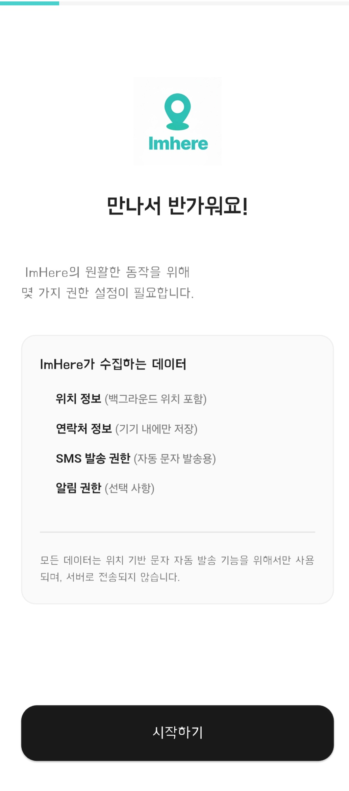
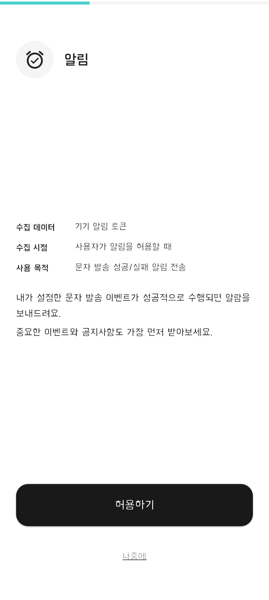
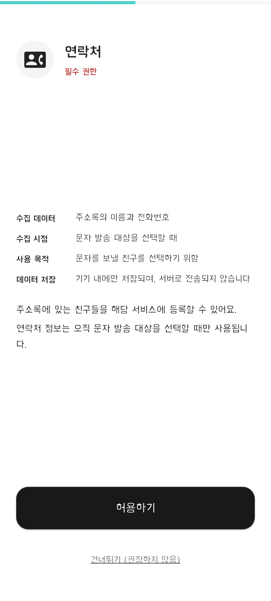
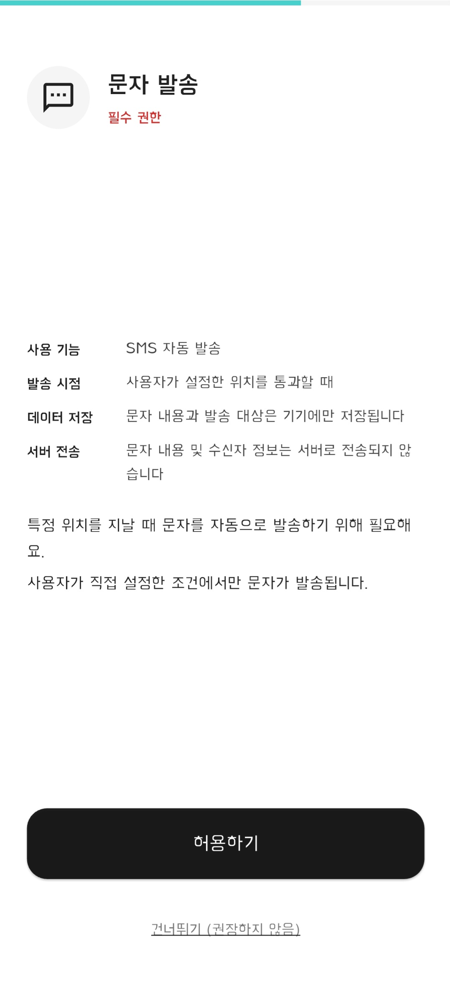
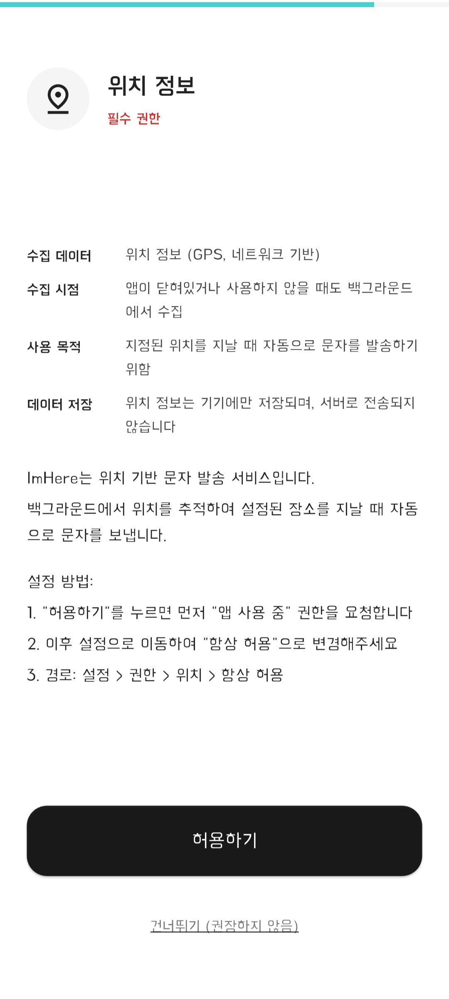
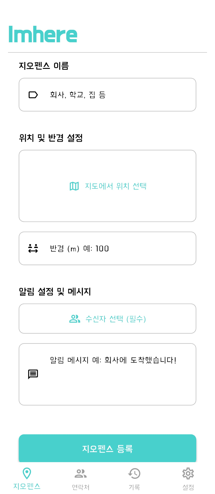
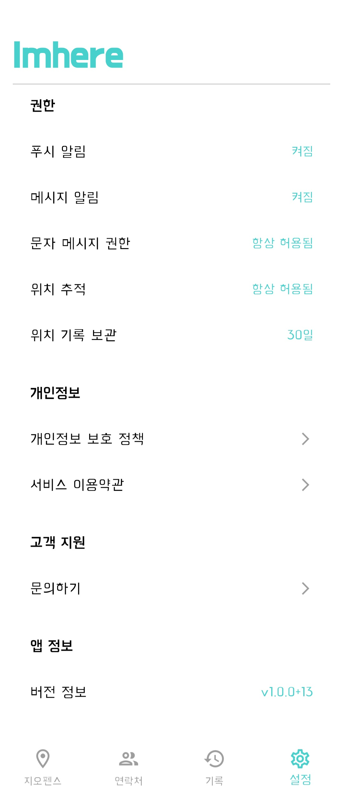

# ImHere
<p align="center">
  
</p>

# 0. 프로젝트 개요
- 해당 프로젝트는 "버스 터미널 도착 30분 전에 연락해" 라는 부모님의 말에서 시작되었습니다.
    - 서울 -> 거제로 이동하는 버스에서 항상 잠을 잤는데, 도착 30분전에 연락을 위해 일어나는 것이 사실상 불가능하였고, 이를 해결하기 위해 위치 기반으로 문자를 보내면 되겠다는 생각을 하였습니다.

### 주요 화면

##### 명시적 권한 요청 화면

<table align="center">
  <tr>
    <td align="center"></td>
    <td align="center"></td>
    <td align="center"></td>
    <td align="center"></td>
    <td align="center"></td>
  </tr>
</table>

##### 서비스 화면

<table align="center">
  <tr>
    <td align="center"></td>
    <td align="center"></td>
    <td align="center"></td>
    <td align="center"></td>
    <td align="center"></td>
  </tr>
</table>

### 주요 특징

- **명시적 권한 안내**: Google 정책에 맞게 명시적 권한 요청 화면
- **카카오 소셜 로그인**: 간편한 인증을 위한 카카오 OAuth2 로그인 지원
- **지오펜스 관리**: 특정 위치와 반경을 설정하여 지오펜스 영역을 등록하고 관리
- **위치 기반 알림**: 지오펜스 진입/이탈 시 자동 알림 발송
- **연락처 연동**: 기기 연락처와 연동하여 알림 수신자 관리
- **기록 관리**: 지오펜스 알림 발송 이력 조회

---

## *1. Skills*
-  

### Libraries
- **State Management**
    - `flutter_riverpod`: 전역 상태 관리, 비동기 로직 처리 및 의존성 주입을 안전하게 구현

- **Architecture & DI**
    - `go_router`: 딥링크 지원 및 직관적인 페이지 이동을 위한 선언형 라우팅 시스템
    - `get_it`, `injectable`: 의존성 주입(DI) 코드 자동 생성 및 서비스 로케이터 패턴 적용

- **Network & Data**
    - `dio`: Interceptor, Timeout 등 강력한 기능을 제공하는 HTTP 클라이언트
    - `json_annotation`: JSON 직렬화/역직렬화(Serialization) 보일러플레이트 코드 자동화

- **Local Storage & Security**
    - `sqflite`: 로컬 데이터 영속성을 위한 내장형 관계형 데이터베이스(SQLite)
    - `flutter_secure_storage`: Access Token 등 민감한 정보를 Keystore/Keychain에 안전하게 저장
    - `flutter_dotenv`: API Key 등 민감한 환경 설정을 코드와 분리하여 보안 강화

- **Map & Location**
    - `flutter_naver_map`: 국내 환경에 최적화된 네이버 지도 SDK 연동 및 오버레이 구현
    - `geolocator`: 디바이스의 실시간 GPS 좌표 수집 및 위치 권한 상태 확인

- **Firebase & Notification**
    - `firebase_core`, `firebase_messaging`: Firebase 프로젝트 초기화 및 FCM 푸시 알림 수신
    - `flutter_local_notifications`: 포그라운드 알림 노출 및 로컬 알림 스케줄링 관리
    - `firebase_crashlytics`: 앱 비정상 종료(Crash) 로그 수집 및 안정성 모니터링
    - `firebase_analytics`: 사용자 행동 패턴 및 이벤트 데이터 분석

- **UI & Utils**
    - `flutter_screenutil`: 다양한 디바이스 화면 크기에 대응하는 반응형 레이아웃 구성
    - `kakao_flutter_sdk`: 카카오 로그인 인증 및 공유하기 기능 연동
    - `permission_handler`: 런타임 접근 권한 요청 프로세스 및 거부 상태 핸들링
    - `package_info_plus`: 앱의 버전 정보 및 빌드 번호 등 메타데이터 조회

---

## 2. 주요 기능

#### 회원가입/로그인
- 카카오 SDK를 이용한 소셜 로그인
- 서버와의 연동을 통한 JWT 토큰 관리
- 보안 저장소를 통한 토큰 안전 보관 및 자동 갱신

#### 지오펜스 관리
- **지오펜스 목록**: 등록된 감시 영역 조회
- **지오펜스 등록**: 네이버 지도를 통한 직관적인 위치 선택 및 반경 설정
- **백그라운드 감지**: 앱이 꺼져있거나 백그라운드 상태에서도 진입/이탈 감지

#### 연락처 관리
- 기기 연락처 권한 획득 및 주소록 동기화
- 지오펜스 이벤트 발생 시 알림을 받을 수신자 선택

#### 기록 관리
- 지오펜스 알림 발송 이력(시간, 위치, 수신자) 자동 저장 및 조회
- 실패 내역 확인

---

## 3. 프로젝트 구조

```
lib/
├── auth/                   # 인증 모듈 (카카오 로그인, 토큰 관리)
│   ├── component/          # 인증 관련 UI 컴포넌트
│   ├── dto/                # 데이터 전송 객체 (Request/Response)
│   ├── service/            # 인증 비즈니스 로직
│   ├── view/               # 로그인 화면
│   └── view_model/         # 인증 상태 관리 (Riverpod)
├── common/                 # 공통 모듈
│   ├── database/           # 로컬 DB 설정 (Sqflite)
│   ├── result/             # 에러 핸들링 래퍼
│   ├── router/             # GoRouter 설정 및 화면 전환 로직
│   ├── theme/              # 앱 테마 및 스타일
│   ├── util/               # 포맷터 등 유틸리티
│   └── view_component/     # 공통 UI 위젯 (버튼, 타이틀 등)
├── contact/                # 연락처 관리 모듈
│   ├── repository/         # 연락처 데이터 접근 계층
│   ├── view/               # 연락처 목록 화면
│   └── view_model/         # 연락처 상태 관리
├── core/                   # 핵심 설정
│   ├── di/                 # 의존성 주입 (GetIt, Injectable)
│   └── dio/                # 네트워크 클라이언트 설정
├── fcm/                    # Firebase Cloud Messaging
│   ├── repository/         # 토큰 및 메시지 처리
│   └── service/            # 알림 서비스 로직
├── geofence/               # 지오펜스 핵심 기능
│   ├── repository/         # 지오펜스 데이터 저장소
│   ├── service/            # 위치 감시 및 트리거 서비스
│   ├── view/               # 지오펜스 등록/목록 지도 화면
│   └── view_model/         # 지오펜스 UI 로직
├── record/                 # 알림 발송 이력
│   ├── repository/         # 기록 데이터 DB 접근
│   ├── view/               # 이력 조회 화면
│   └── view_model/         # 기록 리스트 상태 관리
├── user_permission/        # 권한 관리 및 온보딩
│   ├── concrete/           # 권한별 구현체 (위치, 연락처, 알림 등)
│   ├── model/              # 권한 상태 모델
│   ├── view/               # 권한 요청 화면 (Prominent Disclosure)
│   └── view_model/         # 권한 상태 관리
└── main.dart               # 앱 진입점
```

### 권한 관리 및 온보딩
- **투명한 권한 공개**: Google Play Prominent Disclosure 정책 준수, 권한 요청 전 사용 목적과 수집 데이터 명시
- **스마트 라우팅**: 권한 허용 상태 및 로그인 여부 실시간 감지를 통한 화면 자동 전환
- **모듈화**: 각 권한(위치, 연락처, SMS, 알림)을 개별 서비스로 분리하여 관리

---

## 4. 설치 및 실행 가이드

### 필수 요구사항

- **Flutter SDK**
- **Dart SDK**
- **Android Studio** 또는 **Xcode**

### 환경 변수 설정

프로젝트 루트의 `assets` 폴더 내에 `iam_here_flutter_secret.env` 파일 생성 및 설정

```env
# 카카오 SDK 설정
KAKAO_NATIVE_APP_KEY=your_kakao_native_app_key

# 네이버 지도 설정
NAVER_MAP_CLIENT_ID=your_naver_map_client_id

# 백엔드 API URL
API_BASE_URL=http://your-api-server-url
```

### 실행 방법

1. 의존성 설치

```bash
flutter pub get
```

2. 코드 생성 (Freezed, Injectable, JsonSerializable 등)

```bash
dart run build_runner build -d
```

3. 앱 실행

```bash
# Android
flutter run

# iOS (macOS only)
flutter run -d ios
```

---

## 5. 개발 컨벤션

### 코드 스타일

- **Effective Dart** 스타일 가이드 준수
- **Riverpod** 상태 관리 패턴 적용
- **MVVM** 아키텍처 패턴 준수
- **Dependency Injection** (GetIt + Injectable) 활용

### 테스트

#### Flutter 테스트 실행

```bash
flutter test
```

#### Flutter 테스트 커버리지 확인

```bash
flutter test --coverage
# 리포트는 coverage/html/index.html에서 확인 가능
```

### 커밋 메시지 컨벤션

- **AngularJS Git Commit Convention** 준수

```
[타입] 간단한 제목

상세 설명 (선택사항)

타입:
- feat: 새로운 기능 추가
- fix: 버그 수정
- docs: 문서 수정
- style: 코드 포맷팅, 세미콜론 누락 등
- refactor: 코드 리팩토링
- test: 테스트 코드 추가
- chore: 빌드 업무 수정, 패키지 매니저 설정 등
```
