# ImHere · Mobile (Flutter)

[플레이스토어에서 설치하기](https://play.google.com/store/apps/details?id=com.kdongsu5509.iamhere)

<p align="center">
  
</p>

> **ImHere 모바일 앱** — 사용자가 설정한 지점(Geofence)에 진입하면 앱이 꺼진 상태에서도 OS 가 이를 감지해 지정 연락처에 SMS / FCM 도착 알림을 자동 발송하는 **위치 기반 백그라운드 안심 알리미**.

---

## 0. 프로젝트 개요

### Motivation
**"버스 도착하기 30분 전에는 꼭 연락하거라."**

장거리 이동 중 깊은 잠에 들어 부모님과의 약속을 지키지 못했던 경험에서 이 프로젝트는 시작되었습니다. _"사용자가 신경 쓰지 않아도, 특정 위치에 도달하면 자동으로 알림을 보낼 수는 없을까?"_ 라는 단순한 질문이 핵심 아이디어입니다.

모바일 디바이스의 **OS 레벨 Geofence 서비스**를 활용하여, 앱이 완전히 종료되거나 단말이 재부팅된 이후에도 도착 알림이 동작하는 것을 목표로 합니다.

### 주요 화면

<table align="center">
  <tr>
    <td align="center">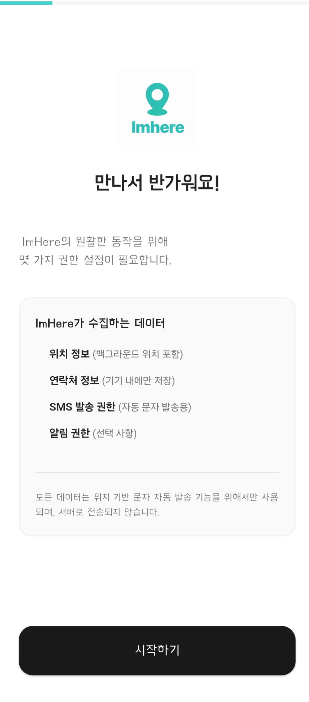</td>
    <td align="center">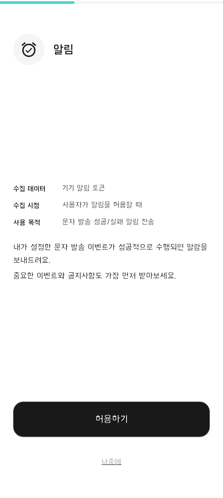</td>
    <td align="center">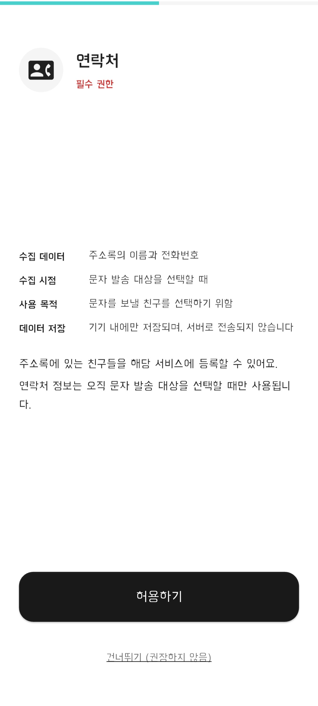</td>
    <td align="center">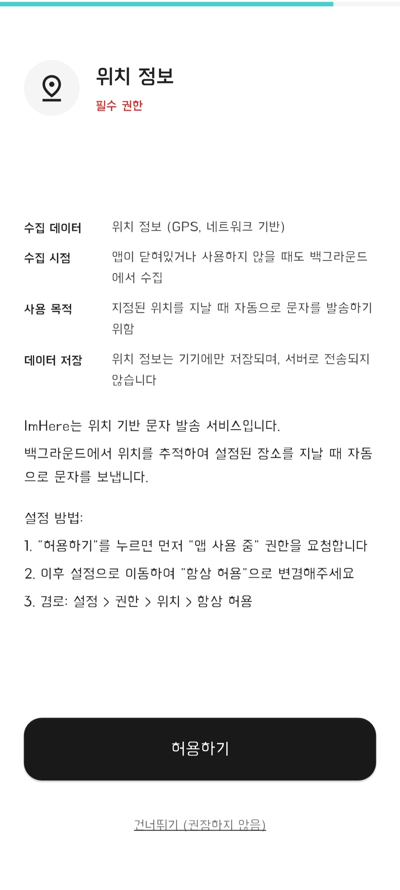</td>
  </tr>
</table>

<table align="center">
  <tr>
    <td align="center"></td>
    <td align="center">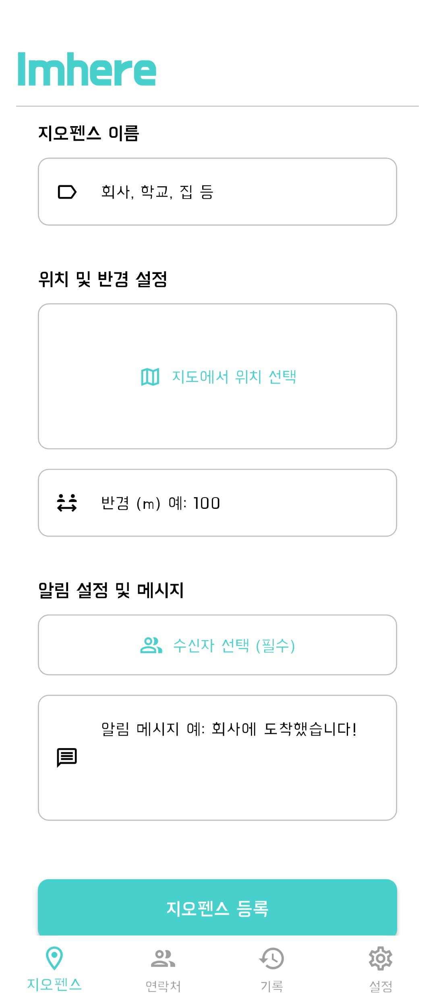</td>
    <td align="center"></td>
    <td align="center">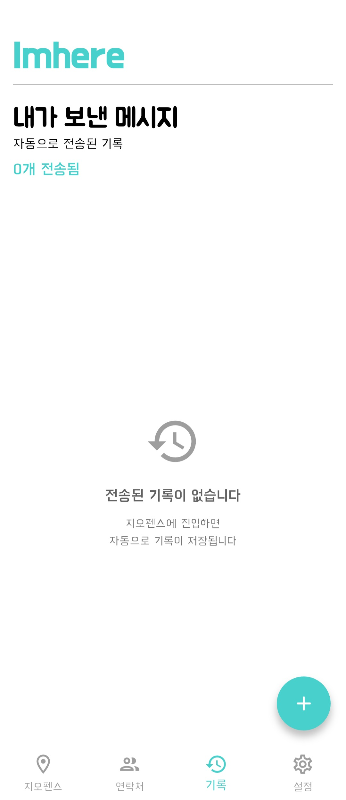</td>
    <td align="center">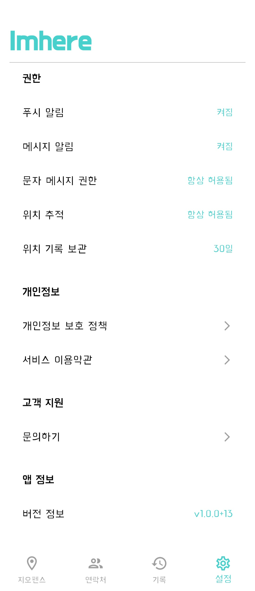</td>
  </tr>
</table>

### 📱 모바일 특화 핵심 가치

| 영역 | 구현 전략 |
|---|---|
| **백그라운드 지속성** | OS 네이티브 Geofence API(`CoreLocation` / `GeofencingClient`) 등록 → 앱 종료 / 단말 재부팅 후에도 진입 감지 가능 |
| **배터리 최적화** | 연속 GPS 스트림 제거. OS 의 셀타워/Wi-Fi/가속도계 기반 저전력 감지에 위임 |
| **백그라운드 아이솔레이트** | `@pragma('vm:entry-point')` + Dart 백그라운드 Isolate 에서 DI / Firebase / sqflite 재부팅 |
| **민감정보 보안** | Access Token · Refresh Token 을 iOS Keychain / Android Keystore 에 암호화 저장 (`flutter_secure_storage`) |
| **권한 투명성** | Google Play Prominent Disclosure 정책 준수 — 목적/데이터/필수 여부 명시 UI |
| **반응형 UI** | `flutter_screenutil` 로 디바이스 크기별 적응형 레이아웃 (`.w` / `.h` / `.sp` / `.r`) |
| **국내 환경 최적화** | 네이버 지도 SDK + 카카오 소셜 로그인 통합 |

---

## 1. *Skills*

    

### 상태 관리 & DI
- **`flutter_riverpod` / `riverpod_annotation`** — UI 상태/비동기 흐름 전담. `@Riverpod(keepAlive: true)` 로 AuthState · GeofenceViewModel 등 전역 상태를 장기 보관.
- **`get_it` + `injectable`** — 서비스/Repository 계층의 DI 컨테이너. `@lazySingleton`, `@injectable`, `@module` 로 선언, `build_runner` 가 `di_setup.config.dart` 자동 생성.
- **`go_router`** — Shell Route + 선언형 라우팅 + 커스텀 전환 애니메이션 (fade, bottom-up).

### 네트워크 & 직렬화
- **`dio`** — HTTP 클라이언트. Access Token 주입 / 401 자동 리프레시를 위한 커스텀 Interceptor 체인.
- **`json_serializable` / `json_annotation`** — DTO 직렬화 자동 생성.

### 로컬 저장 & 보안
- **`sqflite`** — SQLite 기반 로컬 DB. Geofence, Contact, Record, Notification, ServerRecipient 5개 테이블 운영.
- **`flutter_secure_storage`** — 토큰 전용 암호화 저장소 (Keychain/Keystore). 백그라운드 아이솔레이트에서도 접근 가능.
- **`flutter_dotenv`** — `iam_here_flutter_secret.env` 로 API Key / 지도 Client ID 관리.

### 지도 & 위치 & 🔥 백그라운드 Geofence
- **`flutter_naver_map`** — 국내 POI 검색 품질이 우수한 네이버 지도 SDK.
- **`geolocator`** — 현재 위치 조회 / 실시간 권한 상태 확인.
- **`native_geofence`** — OS 레벨 Geofence 등록 플러그인.
  - Android: `GeofencingClient` (Play Services Location) · `BootBroadcastReceiver` 로 재부팅 후 자동 재등록
  - iOS: `CLCircularRegion` · `CLLocationManager.startMonitoring(for:)` · Always 권한 기반 상시 감지
  - 진입 이벤트는 `@pragma('vm:entry-point')` 최상위 함수로 dispatch

### Firebase & 알림
- **`firebase_core`, `firebase_messaging`** — FCM 수신/토큰 관리. 백그라운드 메시지 핸들러 등록.
- **`flutter_local_notifications`** — 포그라운드 알림 노출 및 스케줄링.
- **`firebase_crashlytics`** — 크래시 자동 수집 (백그라운드 아이솔레이트 크래시 포함).
- **`firebase_analytics`** — 사용 흐름 이벤트 수집.
- **`firebase_remote_config`** — 백엔드 Base URL 을 원격 전환 (배포 후 런타임 대응).

### UI & 유틸
- **`flutter_screenutil`** — 디자인 기준 402×874 기반 반응형. 모든 수치에 `.w`/`.h`/`.sp`/`.r` 적용.
- **`kakao_flutter_sdk`** — 카카오 OAuth2 로그인.
- **`permission_handler`** — 위치/연락처/알림 런타임 권한 요청 및 거부 상태 세분 핸들링.
- **`package_info_plus`** — 앱 버전/빌드 번호 표시.

---

## 2. 주요 기능

### 2.1 회원가입 / 로그인

카카오 OAuth2 → OIDC 검증 → 자체 JWT(AccessToken + RefreshToken) 발급 → Keychain/Keystore 저장.

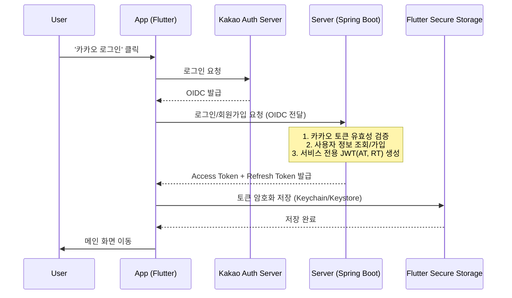
```mermaid
sequenceDiagram
    participant U as User
    participant A as App (Flutter)
    participant K as Kakao Auth Server
    participant S as Server (Spring Boot)
    participant DB as Flutter Secure Storage

    U->>A: '카카오 로그인' 클릭
    A->>K: 로그인 요청
    K-->>A: OIDC 발급
    A->>S: 로그인/회원가입 요청 (OIDC 전달)
    Note over S: 1. 카카오 토큰 유효성 검증<br/>2. 사용자 정보 조회/가입<br/>3. 서비스 전용 JWT(AT, RT) 생성
    S-->>A: Access Token + Refresh Token 발급
    A->>DB: 토큰 암호화 저장 (Keychain/Keystore)
    DB-->>A: 저장 완료
    A->>U: 메인 화면 이동
```

---

### 2.2 Geofence 등록 · 🔥 백그라운드 도착 감지

모바일 플랫폼에서 **앱 종료 상태에서도 안정적으로 동작**시키는 것이 본 프로젝트의 핵심 난제다.

#### 아키텍처 선택
| 옵션 | 배터리 | Kill-Survival | 복잡도 | 채택 |
|---|---|---|---|---|
| Dart 연속 GPS 스트림 | ❌ | ❌ | 낮음 | ❌ |
| Foreground Service 상시 실행 | ❌ | ⚠️ | 중 | ❌ |
| **OS 네이티브 Geofence API** | ✅ | ✅ | 중 | **✅** |

#### 등록 → 진입 → 발송 플로우

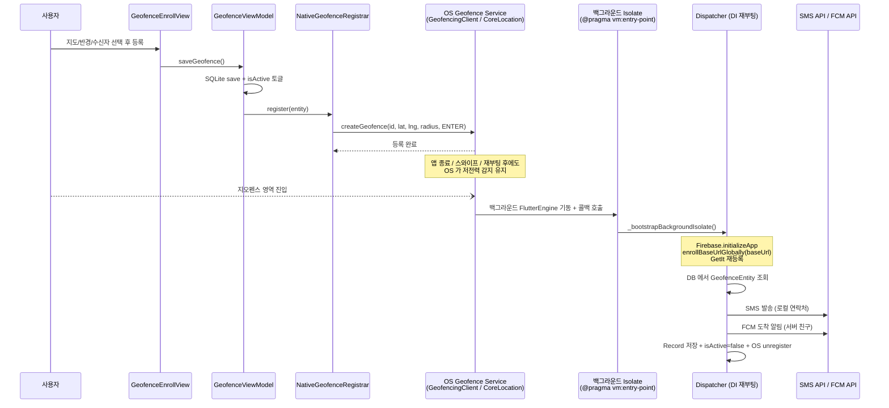
```mermaid
sequenceDiagram
    participant User as 사용자
    participant UI as GeofenceEnrollView
    participant VM as GeofenceViewModel
    participant Registrar as NativeGeofenceRegistrar
    participant OS as OS Geofence Service<br/>(GeofencingClient / CoreLocation)
    participant BG as 백그라운드 Isolate<br/>(@pragma vm:entry-point)
    participant Disp as Dispatcher (DI 재부팅)
    participant API as SMS API / FCM API

    User->>UI: 지도/반경/수신자 선택 후 등록
    UI->>VM: saveGeofence()
    VM->>VM: SQLite save + isActive 토글
    VM->>Registrar: register(entity)
    Registrar->>OS: createGeofence(id, lat, lng, radius, ENTER)
    OS-->>Registrar: 등록 완료
    Note over OS: 앱 종료 / 스와이프 / 재부팅 후에도<br/>OS 가 저전력 감지 유지

    User--)OS: 지오펜스 영역 진입
    OS->>BG: 백그라운드 FlutterEngine 기동 + 콜백 호출
    BG->>Disp: _bootstrapBackgroundIsolate()
    Note over Disp: Firebase.initializeApp<br/>enrollBaseUrlGlobally(baseUrl)<br/>GetIt 재등록
    Disp->>Disp: DB 에서 GeofenceEntity 조회
    Disp->>API: SMS 발송 (로컬 연락처)
    Disp->>API: FCM 도착 알림 (서버 친구)
    Disp->>Disp: Record 저장 + isActive=false + OS unregister
```

핵심 포인트:
- **`@pragma('vm:entry-point')`** 를 부여한 최상위 함수만 AOT 빌드에서 백그라운드 호출 가능.
- **GetIt 은 아이솔레이트별 격리** → 백그라운드에서 `enrollBaseUrlGlobally()` 재호출 필요.
- **1회성 보장** — 진입 성공 시 DB `is_active=false` + OS `removeGeofenceById` 로 재진입 중복 트리거 원천 차단.
- **iOS 20개 리전 제한** — `syncAll` 에서 id 오름차순 top 20 정책으로 초과분 skip.

---

### 2.3 연락처 연동 (로컬 + 서버 친구 하이브리드)

- **로컬 연락처**: 디바이스 주소록에서 선택 → SQLite 저장 → SMS 수신자.
- **서버 친구**: ImHere 앱 가입자 → FCM 도착 알림 수신자.

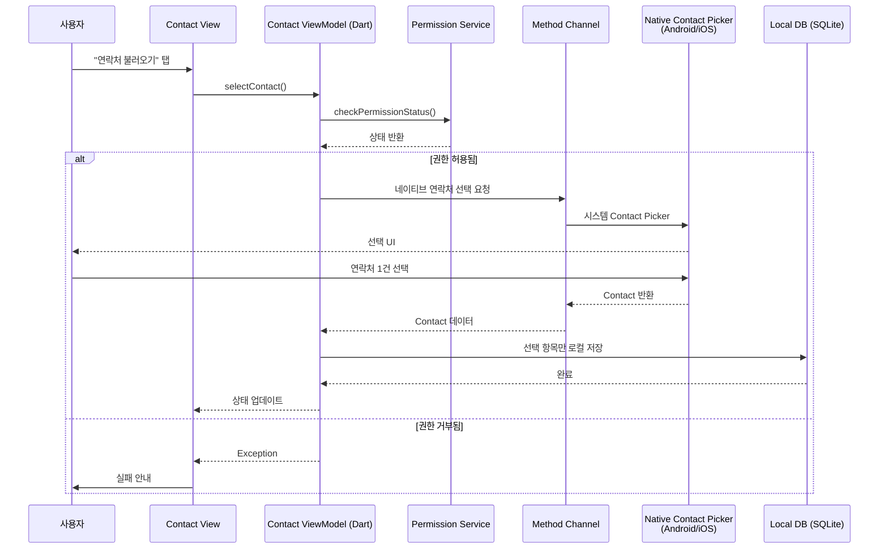
```mermaid
sequenceDiagram
    participant User as 사용자
    participant View as Contact View
    participant VM as Contact ViewModel (Dart)
    participant PermSvc as Permission Service
    participant Channel as Method Channel
    participant Native as Native Contact Picker<br/>(Android/iOS)
    participant DB as Local DB (SQLite)

    User->>View: "연락처 불러오기" 탭
    View->>VM: selectContact()
    VM->>PermSvc: checkPermissionStatus()
    PermSvc-->>VM: 상태 반환

    alt 권한 허용됨
        VM->>Channel: 네이티브 연락처 선택 요청
        Channel->>Native: 시스템 Contact Picker
        Native-->>User: 선택 UI
        User->>Native: 연락처 1건 선택
        Native-->>Channel: Contact 반환
        Channel-->>VM: Contact 데이터
        VM->>DB: 선택 항목만 로컬 저장
        DB-->>VM: 완료
        VM-->>View: 상태 업데이트
    else 권한 거부됨
        VM-->>View: Exception
        View->>User: 실패 안내
    end
```

---

### 2.4 기록 관리

- 진입 감지 시점의 시간/위치/수신자/발송 채널(SMS·FCM)·성공 여부를 **디바이스 로컬에만 적재**. 네트워크 연결 없어도 이력 조회 가능.
- 백그라운드 발송 직후에도 `RecordService` 가 동일한 DB 를 사용하므로 누락이 없다.

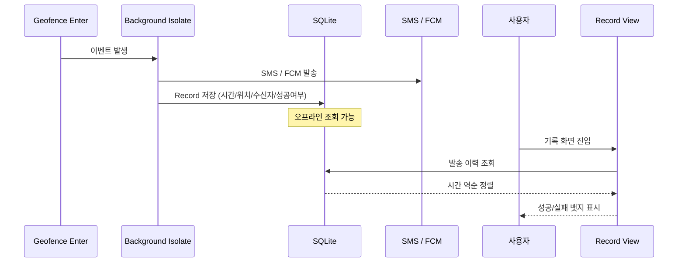
```mermaid
sequenceDiagram
    participant Geo as Geofence Enter
    participant BG as Background Isolate
    participant DB as SQLite
    participant API as SMS / FCM
    participant User as 사용자
    participant UI as Record View

    Geo->>BG: 이벤트 발생
    BG->>API: SMS / FCM 발송
    BG->>DB: Record 저장 (시간/위치/수신자/성공여부)
    Note over DB: 오프라인 조회 가능

    User->>UI: 기록 화면 진입
    UI->>DB: 발송 이력 조회
    DB-->>UI: 시간 역순 정렬
    UI-->>User: 성공/실패 뱃지 표시
```

---

## 3. 프로젝트 구조

### 3.1 아키텍처 개요

본 프로젝트는 **MVVM + Clean Architecture** 변형을 채택한다.

```
┌────────── View (ConsumerWidget) ───────────┐
│  Material / Cupertino 위젯 + ScreenUtil    │
└─────────────────┬──────────────────────────┘
                  │ watch / read
┌─────────────────▼──────────────────────────┐
│  ViewModel (@Riverpod) — UI 상태 / 이벤트   │
└─────────────────┬──────────────────────────┘
                  │ GetIt.get()
┌─────────────────▼──────────────────────────┐
│  Service / Registrar — 비즈니스 규칙         │
│   · NativeGeofenceRegistrar                │
│   · ContactResolutionService               │
│   · SmsNotificationService / FcmArrival    │
└─────────────────┬──────────────────────────┘
                  │
┌─────────────────▼──────────────────────────┐
│  Repository — Dio / sqflite / SecureStorage│
└────────────────────────────────────────────┘
```

#### 핵심 원칙
- **상태 관리 ≠ DI**: UI 상태는 `Riverpod`, 서비스/Repository 의존성은 `GetIt + Injectable`. 한 도구가 두 역할을 겸하면 테스트·이해가 어려워지기 때문.
- **Interface-Driven**: 모든 Service / ViewModel 은 `interface.dart` 로 계약을 선언한 뒤 `@LazySingleton(as: Interface)` 로 구현체 바인딩. 백그라운드 Isolate 에서도 동일한 인터페이스로 주입.
- **반응형 수치**: 픽셀 하드코딩 금지. `20.w`, `10.h`, `15.sp`, `5.r` 로 표현.
- **Platform-agnostic DI**: 플랫폼 특화 로직은 `@module` 하위에 캡슐화 (secure_storage / permission / database).

### 3.2 디렉토리 구조 (실제 코드 기준)

```
lib
├── main.dart                          # 앱 엔트리포인트 + DI/Firebase 부트스트랩
├── firebase_options.dart              # FlutterFire CLI 생성물
│
├── core/                              # 기반 모듈
│   ├── di/                            # GetIt + Injectable 설정
│   │   ├── di_setup.dart
│   │   ├── di_setup.config.dart       # (생성물)
│   │   ├── local_database_module.dart
│   │   ├── secure_storage_module.dart
│   │   └── permission_service_module.dart
│   ├── dio/                           # Dio 모듈 + Interceptor + ApiConfig
│   ├── database/                      # sqflite 공통 엔진 / 테이블 정의
│   │   └── service/                   # Abstract & 테이블별 서비스
│   └── router/                        # go_router + Shell Route + 전환 애니메이션
│
├── feature/                           # 도메인 Feature 모듈
│   ├── auth/                          # 카카오 OIDC + JWT + 토큰 스토리지
│   ├── friend/                        # 친구 검색/요청/차단 + 로컬 연락처
│   ├── geofence/                      # ⭐ 본 프로젝트의 핵심 Feature
│   │   ├── background/                # 🔥 @pragma('vm:entry-point') 콜백
│   │   │   └── geofence_background_callback.dart
│   │   ├── service/                   # Native Registrar / SMS / FCM Arrival 등
│   │   ├── repository/                # Geofence + ServerRecipient 로컬 저장
│   │   ├── view/                      # 지도/등록/수신자 선택 UI
│   │   └── view_model/                # @Riverpod 상태관리
│   ├── record/                        # 발송 이력
│   ├── setting/                       # 설정/약관/버전
│   ├── terms/                         # 약관 서버 조회/동의 API
│   └── user_permission/               # 📱 Prominent Disclosure 온보딩
│
├── integration/                       # 외부 플랫폼 통합
│   ├── firebase/                      # Core + Messaging + RemoteConfig + Crashlytics
│   └── fcm/                           # FCM 토큰 관리
│
└── shared/                            # 도메인 없는 공통
    ├── base/result/                   # Result<T> sealed class
    ├── component/                     # 공통 위젯 / 테마
    └── util/                          # 포맷터 / 상수
```

### 3.3 주요 모듈 설명

#### 🔐 Auth
- `AuthService`: 카카오 SDK → OIDC → 서버 JWT 발급
- `TokenStorageService`: Keychain/Keystore 저장, Dio Interceptor 에서 주입
- `AuthViewModel`: 토큰 만료 감지 시 자동 리프레시

#### 📍 Geofence (핵심)
- `NativeGeofenceRegistrar`: `native_geofence` 플러그인 래핑. `register / unregister / syncAll`.
- `geofence_background_callback.dart`: OS 진입 이벤트 수신 → DI 재부팅 → SMS/FCM 발송 → 레코드 저장 → 1회성 deactivate.
- `GeofenceViewModel`: `@Riverpod(keepAlive: true)` — 전역 권한 상태와 CRUD.
- `GeofenceEnrollView`: 네이버 지도 + 반경 셀렉터 + 수신자 Picker.

#### 👥 Friend
- 서버 친구 관계 API (검색/요청/수락/차단) + 로컬 연락처 Repository 병행.
- 지오펜스 수신자 선택 시 두 소스를 하나의 리스트로 표시.

#### 🔔 User Permission (Prominent Disclosure)
- `UserPermissionView`: PageView 기반 순차 권한 흐름.
- 권한 항목별 `PermissionItem` 으로 추상화 (Location / Contact / FCM / SMS).
- **Always Location 권한 안내** — Android 11+ 은 시스템 설정에서만 선택 가능하므로 딥링크 유도 UI 제공.

#### 🛠 Core
- **Router**: `ShellRoute` 로 하단 네비게이션 공통 레이아웃 유지 + 커스텀 전환.
- **Dio**: 401 시 RefreshToken 로 재시도 후 원요청 재전송 인터셉터.
- **Database**: `@preResolve Database` 로 앱 기동 대기 중 오픈. sqflite 가 아이솔레이트 간 공유 가능해 백그라운드 재사용.

---

## 4. 모바일 플랫폼 설정

### 4.1 Android

`android/app/src/main/AndroidManifest.xml`

| 퍼미션 | 용도 |
|---|---|
| `ACCESS_FINE_LOCATION` | 지도 초기 위치 + Geofence 정밀도 |
| `ACCESS_COARSE_LOCATION` | Fine 권한 거부 시 fallback |
| `ACCESS_BACKGROUND_LOCATION` | 앱 종료 상태 Geofence 감지 (Android 10+) |
| `FOREGROUND_SERVICE_LOCATION` | 포그라운드 서비스 타입 선언 (Android 14+) |
| `READ_CONTACTS` | 로컬 연락처 Picker |
| `POST_NOTIFICATIONS` | Android 13+ 알림 권한 |
| `RECEIVE_BOOT_COMPLETED` | 재부팅 후 Geofence 재등록 |
| `WAKE_LOCK` | 백그라운드 FlutterEngine 기동 시 CPU 유지 |
| `INTERNET` | API / FCM |

### 4.2 iOS

`ios/Runner/Info.plist`

| 키 | 값 |
|---|---|
| `NSLocationWhenInUseUsageDescription` | 지도 표시 / Geofence 설정 목적 |
| `NSLocationAlwaysAndWhenInUseUsageDescription` | 백그라운드 Geofence 목적 (Always 승인 필수) |
| `NSContactsUsageDescription` | 연락처 Picker 목적 |
| `UIBackgroundModes` | `location`, `fetch`, `processing` |
| `LSApplicationQueriesSchemes` | `sms`, `kakaokompassauth` 등 |

### 4.3 빌드/실행

```bash
# 1. 의존성
flutter pub get

# 2. 코드 생성 (Riverpod · Injectable · JsonSerializable · FreezedLike)
dart run build_runner build --delete-conflicting-outputs
# 감시 모드
dart run build_runner watch --delete-conflicting-outputs

# 3. 환경변수 + 실행
flutter run --dart-define-from-file=iam_here_flutter_secret.env

# 분석 (커밋 전 필수)
flutter analyze
```

환경변수 파일 예시 — `iam_here_flutter_secret.env`:

```env
KAKAO_NATIVE_APP_KEY=your_kakao_native_app_key
NAVER_MAP_CLIENT_ID=your_naver_map_client_id
API_BASE_URL=http://your-api-server-url
```

---

## 5. 라우팅 구조

`go_router` 기반 선언형 라우팅 + Shell Route 로 하단 네비게이션 공통 유지.

```
/user-permission    # 온보딩 (최초 1회)
/auth               # 카카오 로그인
/geofence           # 메인 (지오펜스 목록)
  └── /enroll       # 지오펜스 등록
/friend             # 친구/연락처 관리
/record             # 발송 이력
/setting            # 설정 / 약관 / 버전
```

`routing_logic.dart` 에서 앱 기동 시 리다이렉트:

```mermaid
flowchart TD
    A[앱 시작] --> B{권한 모두 허용?}
    B -->|아니오| C[/user-permission]
    B -->|예| D{로그인 완료?}
    D -->|아니오| E[/auth]
    D -->|예| F{Geofence 재동기화}
    F --> G[/geofence]
```

기동 시점에 `_syncNativeGeofencesOnStart()` 가 DB 의 활성 Geofence 를 OS 에 재등록하여, 앱 삭제 후 재설치 · OS 설정에서 앱 권한 변경 등으로 어긋난 상태를 보정한다.

---

## 6. 에러 핸들링

### Result 패턴

```dart
sealed class Result<T> { ... }
class Success<T> extends Result<T> { ... }
class Failure<T> extends Result<T> { ... }
```

- 네트워크/DB 경계에서 예외를 `Result` 로 포장. UI 계층은 `handle(onSuccess, showSnackBar)` 로 소비.
- 백그라운드 Isolate 내부에서는 예외가 부상(surface)되지 않기 때문에 **예외 경계마다 `log()` 로 흔적**을 남긴다.

### Firebase Crashlytics

- `runZonedGuarded` 로 Dart 에러를 가로채 자동 업로드.
- 백그라운드 아이솔레이트 초기화에도 `Firebase.initializeApp` 가드 포함.

---

## 7. 권한 관리 & 온보딩

Google Play **Prominent Disclosure** 를 준수하는 명시적 권한 온보딩 플로우.

1. **IntroPage** — 앱 가치 제안 + 필요 권한 리스트
2. **PermissionPage** — 권한별 개별 설명 + 요청
   - 알림(FCM, Android 13+)
   - 연락처(SMS 수신자 선택)
   - 위치(Background 포함; iOS 는 Always 선택 유도)
3. **FinishPage** — 완료 → 메인 진입

각 화면은 다음을 명시한다:

- **사용 목적**: 왜 필요한지
- **수집 데이터**: 어떤 정보에 접근하는지
- **필수 여부**: 기능 차단 여부

---

## 8. 개발 컨벤션

### 코드 스타일
- **Effective Dart** 가이드 준수
- **MVVM + Clean** 계층 구분
- **flutter_screenutil 수치** 적용 (하드코딩된 픽셀 금지)
- **interface 우선 작성 → 구현 → `build_runner`** 순의 Harness Loop

### Riverpod 규칙
- `provider` 패키지 사용 금지. `flutter_riverpod` + `riverpod_annotation` 만 사용.
- 비동기 상태는 `AsyncValue` 로 래핑. UI 는 `when(data, loading, error)`.

### 테스트

```bash
# 단위 / 위젯 테스트
flutter test

# 커버리지 (Windows)
choco install lcov
Set-ExecutionPolicy RemoteSigned -Scope CurrentUser
.\scripts\obvious_test.ps1

# 커버리지 (macOS)
brew install lcov
chmod +x scripts/obvious_test.sh
./scripts/obvious_test.sh
```

- `sqflite_common_ffi` 로 데스크톱 환경에서도 DB 테스트 가능.
- `mockito` 로 Dio / Service Mock 생성.

---

## 9. 커밋 메시지 컨벤션

**AngularJS Git Commit Convention** 준수.

```
[타입] 간단한 제목

상세 설명 (선택사항)

타입:
- feat: 새로운 기능 추가
- fix: 버그 수정
- docs: 문서 수정
- style: 코드 포맷팅, 세미콜론 누락 등
- refactor: 코드 리팩토링
- test: 테스트 코드 추가
- chore: 빌드 업무 수정, 패키지 매니저 설정 등
```

---

## 10. 관련 문서

- 백엔드 API Swagger: <https://fortuneki.site/swagger-ui/index.html>
- 최근 아키텍처 전환 보고서: [`result.md`](./result.md) — Dart 연속 스트림 → OS 네이티브 Geofence 이관
- 플레이스토어: <https://play.google.com/store/apps/details?id=com.kdongsu5509.iamhere>
